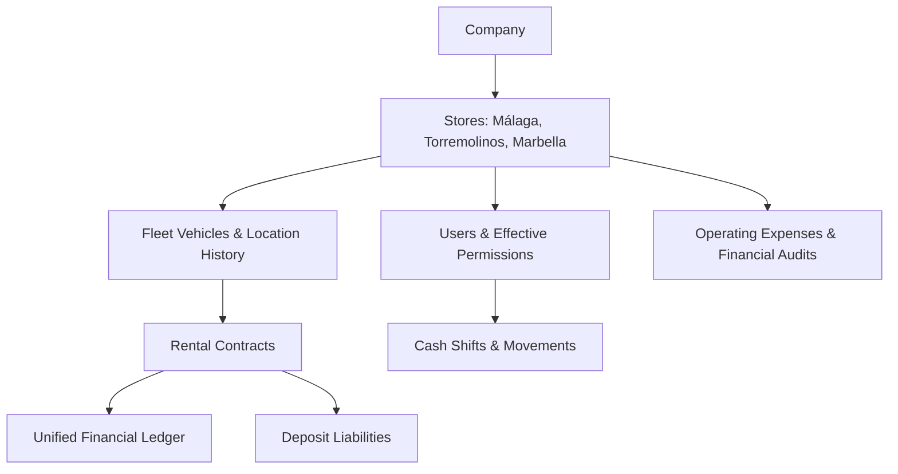

# 🚲 QQBikes Rental & Store Management System
## Unified Master Architecture, SSOT Database Specifications & PWA/TWA Deployment Guide

---

## 1. Purpose & Business Scope

This master specification defines the architecture, database schema, operational invariants, security controls, and PWA/TWA mobile store deployment process for the **QQBikes Rental & Store Management System**.

The platform replaces legacy Excel and paper-based workflows with a unified multi-store operational core:
- **Centralized Rental & POS Counter Engine**
- **Multi-Store & Branch Location Scoping (Málaga, Torremolinos, Marbella)**
- **Employee Management, Historical Hourly Rates, Attendance & Shift Swaps**
- **Audited Monthly Payroll Processing**
- **Vehicle Fleet Management & Multi-Store Relocation History**
- **Repair Ticket Catalog, Work Orders & Labor Rates**
- **Operating Expense Ledger & Reversal Financial Audits**
- **Progressive Web App (PWA) & Trusted Web Activity (TWA) Android Store Deployment**

---

## 2. Core Architectural Principles & Invariants



### Core Business & Technical Invariants

1. **Company Isolation**: Every database entity is bound to `company_id` via JWT authentication.
2. **Store Scoping**: Operational data belongs to a physical store. Requests with explicit `X-Store-Context: <id>` header operate on that store. Read/reporting endpoints allow `activeStoreId = null` (All Stores Context), whereas write operations attempted with `activeStoreId = null` are rejected with **HTTP 403 Forbidden** (Invariant 13).
3. **Single Open Shift Constraint**: To prevent register cash drawer discrepancies, MySQL enforces at most one `OPEN` shift per physical store using a stored generated column:
   ```sql
   open_shift_store_id BIGINT GENERATED ALWAYS AS (
     CASE WHEN status = 'OPEN' THEN store_id ELSE NULL END
   ) STORED,
   UNIQUE KEY uq_one_open_shift (open_shift_store_id)
   ```
4. **Historical Price & Payroll Snapshot**: Contract unit prices and employee rate histories are snapshotted permanently at execution time. Future catalog or rate edits MUST NEVER mutate historical contracts or locked payroll records.
5. **Card vs. Cash Ledger Isolation**: Payments made via `CARD` MUST NEVER create entries in `cash_movements`. The `cash_movements` table is strictly reserved for physical cash drawer transactions (`CASH`).
6. **Deposit Accounting**: Customer deposits are financial liabilities (`HELD`), not revenue, until legitimately retained for damage or extra charges.
7. **Append-Only Financial Ledger**: Financial movements are logged in `financial_events` and `financial_audits`. Physical deletion of financial transactions is strictly forbidden.
8. **Timezone & Date Standard Policy**:
   - **Database & Backend**: All timestamps are stored and evaluated exclusively in **UTC** (`ISO 8601`).
   - **Frontend UI**: Formatted dynamically according to the store's local timezone (e.g., `Europe/Madrid`).
9. **Global Audit Foreign Keys Standard**:
   - Primary keys use `BIGINT AUTO_INCREMENT`.
   - All audit reference columns (`created_by`, `updated_by`, `approved_by`, `cancelled_by`) MUST use `BIGINT` foreign keys referencing `users(id)`.

---

## 3. User Roles & Permission Model

The system utilizes a 2-role permission model with store-scoped assignment mappings:

### ADMIN (Facility / Store Administrator)
- Full administrative access across authorized stores.
- Create/update stores, pricing rules, rate plans, and vehicle categories.
- Manage employee rates, shift templates, overtime approvals, and monthly payroll.
- Review closed cash shifts, financial P&L reports, and audit logs.
- Void operating expenses with mandatory justification logs.

### EMPLOYEE (Counter & Front-Desk Staff)
- Access scoped to assigned physical store (`store_id`).
- Create and search customer profiles.
- Process vehicle rentals, extensions, and returns with deposit handling.
- Record cash/card payments and issue receipts.
- Open/close assigned cash shifts with physical drawer reconciliation.
- Create vehicle repair tickets and log attendance (Clock-In / Clock-Out).

---

## 4. Multi-Store Infrastructure

The system natively supports multi-branch operations:

```text
Company (company_id: 1)
 ├── Málaga Beach Campsite Store (store_id: 1)
 ├── Torremolinos Central Store (store_id: 2)
 └── Marbella Port & Marina Hub (store_id: 3)
```

Every operational record contains a mandatory `store_id` foreign key. Transfers of employees (`EmployeeStoreHistory`) and vehicles (`FleetLocationHistory`) record effective start/end timestamps and transfer reasons.

---

## 5. Technology Stack & Directory Structure

- **Backend Framework**: Node.js, Express, TypeScript (`tsx`).
- **Frontend Framework**: Angular 18 (Standalone Components, Signals, RxJS).
- **Database Layer**: MySQL 8+ / Memory Dataset Fallback with ACID transactions.
- **Styling**: Vanilla CSS with modern dark mode aesthetic & responsive layout.
- **Mobile Deployment**: Progressive Web App (PWA) & Trusted Web Activity (TWA).

### Directory Layout
```text
QQBikes/
 ├── backend/
 │    ├── src/
 │    │    ├── controllers/    # API Request Controllers
 │    │    ├── db/             # Schema Definitions & Mock Dataset
 │    │    ├── middleware/     # Auth, Store Scope, Tracing, Logger
 │    │    ├── routes/         # Express Router Modules
 │    │    ├── services/       # PnlService & Business Engines
 │    │    ├── tests/          # Modular Integration Test Suite (66 Tests)
 │    │    ├── app.ts          # Express Application Export
 │    │    └── server.ts       # Server Entry Point
 ├── frontend/
 │    ├── public/              # Static Assets, manifest.json, .well-known/assetlinks.json
 │    └── src/app/             # Angular Components, Services & Interceptor
 ├── .github/workflows/        # CI/CD Workflows (CI, PWA/TWA, Security Audit)
 ├── package.json
 └── docker-compose.yml
```

---

## 6. Core Database Tables & Data Dictionary

All financial amounts use `DECIMAL(12,2)` (never floating point).

### 6.1 `companies`
- `id` (BIGINT, PK)
- `legal_name` (VARCHAR)
- `currency` (VARCHAR, default 'EUR')
- `timezone` (VARCHAR, default 'Europe/Madrid')

### 6.2 `stores`
- `id` (BIGINT, PK)
- `company_id` (BIGINT, FK -> companies.id)
- `name` (VARCHAR)
- `code` (VARCHAR, UNIQUE)
- `city` (VARCHAR)
- `address` (VARCHAR)
- `phone` (VARCHAR)
- `is_active` (BOOLEAN)
- `initial_cash_float` (DECIMAL(12,2))

### 6.3 `users`
- `id` (BIGINT, PK)
- `company_id` (BIGINT, FK -> companies.id)
- `store_id` (BIGINT, FK -> stores.id)
- `user_type` (ENUM: 'ADMIN', 'EMPLOYEE')
- `username` (VARCHAR)
- `email` (VARCHAR)
- `password_hash` (VARCHAR)
- `is_active` (BOOLEAN)

### 6.4 `vehicles`
- `id` (BIGINT, PK)
- `store_id` (BIGINT, FK -> stores.id)
- `home_store_id` (BIGINT, FK -> stores.id)
- `current_store_id` (BIGINT, FK -> stores.id)
- `category` (VARCHAR)
- `qr_code` (VARCHAR)
- `frame_number` (VARCHAR)
- `name` (VARCHAR)
- `status` (ENUM: 'AVAILABLE', 'RENTED', 'RESERVED', 'MAINTENANCE', 'DAMAGED', 'LOST', 'RETIRED', 'TRANSFER_PENDING')
- `deposit_amount` (DECIMAL(12,2))
- `rate_1h`, `rate_1d` (DECIMAL(12,2))

### 6.5 `rental_contracts`
- `id` (BIGINT, PK)
- `contract_number` (VARCHAR)
- `store_id` (BIGINT, FK -> stores.id)
- `pickup_store_id` (BIGINT, FK -> stores.id)
- `return_store_id` (BIGINT, FK -> stores.id)
- `revenue_store_id` (BIGINT, FK -> stores.id)
- `customer_name`, `customer_passport`, `customer_phone` (VARCHAR)
- `status` (ENUM: 'DRAFT', 'ACTIVE', 'RETURN_PENDING', 'OVERDUE', 'COMPLETED', 'CANCELLED')
- `rental_fee` (DECIMAL(12,2))
- `deposit_collected`, `deposit_refunded`, `deposit_retained` (DECIMAL(12,2))
- `payment_method` (ENUM: 'CASH', 'CARD')

### 6.6 `expenses`
- `id` (BIGINT, PK)
- `store_id` (BIGINT, FK -> stores.id)
- `category` (VARCHAR)
- `amount` (DECIMAL(12,2))
- `description` (TEXT)
- `date` (DATE)
- `status` (ENUM: 'ACTIVE', 'VOIDED')
- `created_by` (BIGINT, FK -> users.id)

### 6.7 `financial_events`
- `id` (BIGINT, PK)
- `company_id` (BIGINT, FK -> companies.id)
- `store_id` (BIGINT, FK -> stores.id)
- `source_type` (ENUM: 'CONTRACT', 'REPAIR', 'EXPENSE')
- `source_id` (BIGINT)
- `type` (ENUM: 'RENTAL_PAYMENT', 'REPAIR_PAYMENT', 'DEPOSIT_COLLECTED', 'DEPOSIT_APPLIED_TO_CHARGE', 'DEPOSIT_REFUNDED', 'OPERATING_EXPENSE')
- `amount` (DECIMAL(12,2))
- `direction` (ENUM: 'IN', 'OUT', 'NONE')
- `payment_method` (ENUM: 'CASH', 'CARD', 'BANK_TRANSFER')

---

## 7. PWA & TWA Android Store Deployment Guide

The application functions as a **Progressive Web App (PWA)** and **Trusted Web Activity (TWA)** for Android devices without browser URL bar address frames.

### 7.1 Web Application Manifest Configuration (`frontend/public/manifest.json`)

```json
{
  "name": "QQBikes - نظام إدارة التأجير والمتاجر",
  "short_name": "QQBikes",
  "description": "تطبيق متكامل لإدارة تأجير الدراجات والسكوترات الكهربائية، العقود، التأمينات والشفتات في الفروع الساحلية",
  "id": "./index.html",
  "start_url": "./index.html",
  "scope": "./",
  "display": "standalone",
  "background_color": "#0b0f19",
  "theme_color": "#0b0f19",
  "orientation": "any",
  "lang": "ar",
  "dir": "rtl",
  "categories": ["business", "lifestyle", "productivity"],
  "prefer_related_applications": false,
  "icons": [
    {
      "src": "assets/icon-192.png",
      "sizes": "192x192",
      "type": "image/png",
      "purpose": "any"
    },
    {
      "src": "assets/icon-192.png",
      "sizes": "192x192",
      "type": "image/png",
      "purpose": "maskable"
    },
    {
      "src": "assets/icon-512.png",
      "sizes": "512x512",
      "type": "image/png",
      "purpose": "any"
    },
    {
      "src": "assets/icon-512.png",
      "sizes": "512x512",
      "type": "image/png",
      "purpose": "maskable"
    }
  ],
  "screenshots": [
    {
      "src": "assets/screenshot-mobile.png",
      "sizes": "640x1136",
      "type": "image/png",
      "form_factor": "narrow",
      "label": "واجهة تطبيق QQBikes لإدارة التأجير على الهواتف"
    },
    {
      "src": "assets/screenshot-desktop.png",
      "sizes": "1280x720",
      "type": "image/png",
      "form_factor": "wide",
      "label": "عرض شاشة الكمبيوتر ولوحة تحكم الفروع"
    }
  ]
}
```

### 7.2 TWA Metadata & Package Parameters
- **Package Name (Application ID)**: `com.qqbikes.app.twa`
- **Digital Asset Links Path**: `frontend/public/.well-known/assetlinks.json`
- **Keystore Path**: `/home/ahmet/Desktop/QQBikes/qqbikes-release-key.jks`
- **Alias**: `qqbikes`
- **Key Password**: `qqbikes_secret`
- **SHA-256 Fingerprint**:
  `4F:8A:12:9C:3E:7B:66:9A:01:88:E2:B5:44:CD:77:E1:90:3A:88:BC:11:F4:6D:E8:29:9C:55:AF:33:10:88:BB`

### 7.3 Digital Asset Links Specification (`frontend/public/.well-known/assetlinks.json`)

Served without HTTP redirects at `https://<YOUR-DOMAIN>/.well-known/assetlinks.json`:
```json
[
  {
    "relation": [
      "delegate_permission/common.handle_all_urls"
    ],
    "target": {
      "namespace": "android_app",
      "package_name": "com.qqbikes.app.twa",
      "sha256_cert_fingerprints": [
        "4F:8A:12:9C:3E:7B:66:9A:01:88:E2:B5:44:CD:77:E1:90:3A:88:BC:11:F4:6D:E8:29:9C:55:AF:33:10:88:BB"
      ]
    }
  }
]
```

### 7.4 Step-by-Step Signed APK Production Pipeline

To resolve `App not installed as package appears to be invalid`:

#### 1. Keystore Generation (RSA-2048 Alignment)
```bash
keytool -genkeypair -v \
  -keystore /home/ahmet/Desktop/QQBikes/qqbikes-release-key.jks \
  -alias qqbikes \
  -keyalg RSA \
  -keysize 2048 \
  -validity 10000 \
  -storepass qqbikes_secret \
  -keypass qqbikes_secret \
  -dname "CN=QQBikes System, OU=Management, O=QQBikes, L=Malaga, ST=Malaga, C=ES"
```

#### 2. Clean Unsigned APK Copy
```bash
cp "/path/to/unsigned.apk" /home/ahmet/Desktop/QQBikes/qqbikes-unsigned.apk
```

#### 3. APK Signing & ZipAlign via `uber-apk-signer`
```bash
java -jar /tmp/uber-apk-signer.jar \
  --apks /home/ahmet/Desktop/QQBikes/qqbikes-unsigned.apk \
  --ks /home/ahmet/Desktop/QQBikes/qqbikes-release-key.jks \
  --ksAlias qqbikes \
  --ksPass qqbikes_secret \
  --ksKeyPass qqbikes_secret \
  --out /home/ahmet/Desktop/QQBikes
```

Produces aligned, signed APK package:
`/home/ahmet/Desktop/QQBikes/qqbikes-aligned-signed.apk` $\rightarrow$ `qqbikes.apk`.

#### 4. Certificate Verification
```bash
keytool -printcert -jarfile /home/ahmet/Desktop/QQBikes/qqbikes.apk
```

---

## 8. Continuous Integration & Automation (GitHub Actions)

The repository contains 3 automated GitHub Action Workflows:
1. **`ci.yml`**: Runs Node 22.x LTS build (`ng build && tsc`), executes all 66 backend integration tests, verifies build output artifacts, and validates Docker Compose builds on every push to `main`.
2. **`pwa-twa-verification.yml`**: Validates manifest structure, `assetlinks.json` domain ownership, and package ID `com.qqbikes.app.twa`.
3. **`security-audit.yml`**: Conducts automated dependency vulnerability scans via `npm audit`.

---

## 9. Modular Integration Test Suite

Execute the full 66-endpoint backend test suite:
```bash
npm test
```
Or run individual test modules:
```bash
npx tsx backend/src/tests/auth.test.ts
npx tsx backend/src/tests/stores.test.ts
npx tsx backend/src/tests/expenses.test.ts
npx tsx backend/src/tests/payroll.test.ts
```
