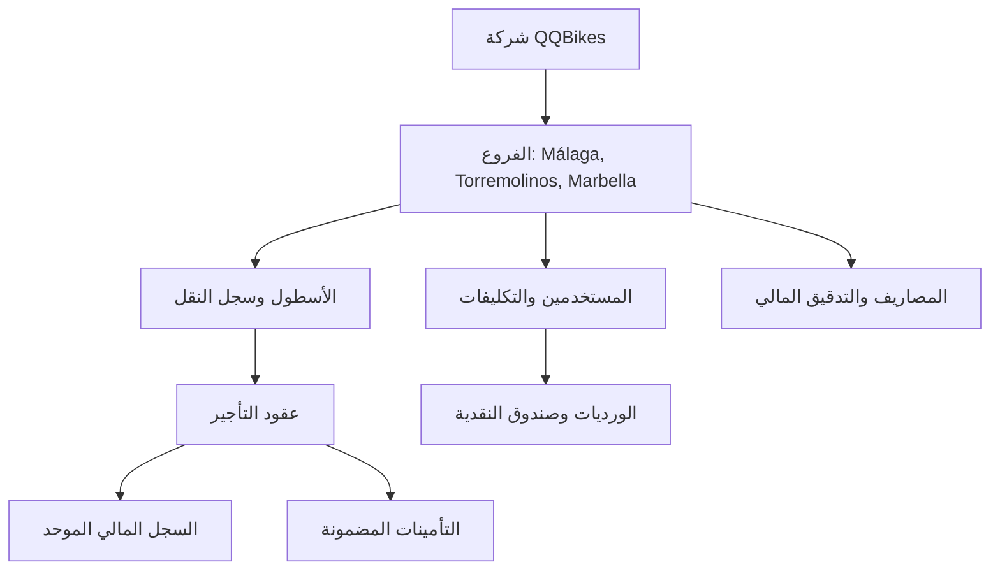

# 🚲 نظام إدارة التأجير والمتاجر QQBikes - المرجع المعماري الشامل ودليل التثبيت
## SSOT Master Architectural Specification, Financial Ledger & PWA/TWA Mobile Guide

[🌐 English Specification](QQBikes_Master_Specification_and_Deployment_Guide.md) | [🇸🇦 المرجع الشامل باللغة العربية](QQBikes_Master_Specification_and_Deployment_Guide_AR.md)

---

## 🌐 روابط التجربة والتشغيل التفاعلي المباشر (Live Interactive Trial Links)

- **🖥️ واجهة النظام التفاعلية (Interactive System UI)**: [http://localhost:5000](http://localhost:5000)
- **📊 تقرير الأرباح والخسائر بالفروع (Branch P&L Performance API)**: `http://localhost:5000/api/v1/stores/pnl`
- **⚙️ فحص المستخدم والتكليفات (Auth Verification Endpoint)**: `http://localhost:5000/api/v1/auth/me`
- **📱 ملف الربط الذكي للأندرويد (Digital Asset Links)**: `http://localhost:5000/.well-known/assetlinks.json`
- **🧪 تشغيل الـ 66 اختباراً تكاملياً**: `npm test`

---

## 1. الغرض ونطاق العمل التجاري

تحدد هذه الوثيقة المرجعية المصدر الوحيد للحقيقة (Single Source of Truth - SSOT) لمعمارية النظام، وقواعد البيانات، والحسابات المالية، وضوابط الأمان، ودليل نشر تطبيقات الـ PWA والـ TWA لـ **نظام QQBikes لإدارة التأجير والمتاجر المتعددة**.

يحل النظام محل العمليات الورقية والإكسيل عبر توفير:
- **كاونتر التأجير المباشر (POS Counter Engine)**.
- **إدارة الفروع المتعددة والعزل التجاري (Málaga, Torremolinos, Marbella)**.
- **إدارة الموظفين وسجل الأجور التاريخية وحساب الحضور والانصراف وتبديل الأدوار**.
- **محرك احتساب الرواتب الشهرية والتدقيق المالي**.
- **إدارة أسطول المركبات وسجل النقل بين الفروع**.
- **كتالوج ورشة الصيانة وقطع الغيار وأجور الأيدي العاملة**.
- **دفتر المصاريف التشغيلية وعمليات التدقيق المالي العكسية (Financial Audits)**.
- **تطبيق PWA وتطبيق أندرويد موقّع عبر Trusted Web Activity (TWA)**.

---

## 2. المبادئ المعمارية والقواعد المالية الصارمة



### القواعد المعمارية والمالية الصارمة (Invariants)

1. **عزل الشركة**: كل عنصر في قاعدة البيانات مرتبط بـ `company_id` عبر التوثيق بـ JWT.
2. **عزل الفروع (Store Scoping)**: البيانات التنافسية تنتمي صراحة للفرع `store_id`. يتم تمرير هيدر `X-Store-Context: <id>` مع كل طلب. في حال عدم إرسال الهيدر في طلبات الكتابة، يتم رفض الطلب صراحة بـ **HTTP 403 Forbidden** (القاعدة المعمارية 13).
3. **قيد الوردية المفتوحة الواحدة (Single Open Shift Constraint)**: لمنع التضارب في الدرج النقدي، يفرض MySQL فتح وردية واحدة فقط لكل فرع عبر العمود المولد:
   ```sql
   open_shift_store_id BIGINT GENERATED ALWAYS AS (
     CASE WHEN status = 'OPEN' THEN store_id ELSE NULL END
   ) STORED,
   UNIQUE KEY uq_one_open_shift (open_shift_store_id)
   ```
4. **تجميد الأسعار والرواتب التاريخية (Historical Price & Payroll Snapshot)**: يتم نسخ أسعار العقود وأجور الموظفين صراحة وقت إنشاء العقد أو الوردية. التعديلات المستقبلية على قائمة الأسعار لن تعدل إطلاقاً البيانات المالية التاريخية.
5. **عزل معاملات البطاقات عن النقدية**: المعاملات بواسطة البطاقات (`CARD`) لا تنشئ أي حركة في جدول `cash_movements` المخصص حصراً للنقدية الفيزيائية (`CASH`).
6. **حساب التأمينات**: التأمينات المودعة هي التزامات مالية وليست إيرادات حتى يتم خصم جزء منها صراحة وبسبب مبرر.
7. **السجل المالي غير القابل للحذف (Append-Only Ledger)**: تُسجل جميع الحركات المالية في `financial_events` و `financial_audits` ولا يُسمح بالحذف الفيزيائي المعماري.
8. **معيار التوقيت الدولي (UTC Standard Policy)**:
   - **قاعدة البيانات والباك اند**: تُخزن كافة التواريخ وتُحسب بالتوقيت العالمي UTC بصيغة ISO-8601.
   - **الواجهة الأمامية**: تُعرض التواريخ بالتوقيت المحلي للفرع (مثل `Europe/Madrid`).

---

## 3. نموذج الصلاحيات والأدوار

يعتمد النظام نموذج صلاحيات مبسط ومباشر:

### ADMIN (مدير النظام والفرع)
- الوصول الإداري الكامل للفروع المصرحة.
- إنشاء وتحديث الفروع، وقواعد الأسعار، والتساد، وكتالوج الصيانة.
- إدارة أجور الموظفين، وقوالب الورديات، واعتامد الساعات الإضافية والرواتب الشهرية.
- مراجعة إغلاق الورديات، وتقارير P&L المالية، وسجلات التدقيق.
- إلغاء المصاريف التشغيلية مع إدخال سبب الإلغاء الإجباري.

### EMPLOYEE (موظف الكاونتر والواجهة)
- محدد صراحة بالفرع المعين (`store_id`).
- إنشاء وتصفح ملفات العملاء.
- إنشاء عقود التأجير، التمديد، والإرجاع مع تسوية التأمينات.
- استلام المدفوعات النقدية/البطاقات وإصدار الإيصالات.
- فتح وإغلاق الورديات ومطابقة صندوق النقدية.
- إنشاء تذاكر الصيانة وتسجيل الحضور والانصراف.

---

## 4. البنية التحتية للفروع المتعددة

دعم كامل لجميع الفروع:
```text
Company (company_id: 1)
 ├── Málaga Beach Campsite Store (store_id: 1)
 ├── Torremolinos Central Store (store_id: 2)
 └── Marbella Port & Marina Hub (store_id: 3)
```

---

## 5. هيكل المشروع والتقنيات المستخدمة

- **الباك اند**: Node.js, Express, TypeScript (`tsx`).
- **الواجهة الأمامية**: Angular 18 (Standalone Components, Signals, RxJS).
- **قاعدة البيانات**: MySQL 8+ / Memory Dataset Fallback مع معاملات ACID.
- **التشغيل الموبايل**: Progressive Web App (PWA) & Trusted Web Activity (TWA).

---

## 6. جدول مصفوفة الاختبارات التكاملية הـ 19 (66/66 ناجح)

تشغيل كامل الاختبارات:
```bash
npm test
```

| ملف الاختبار | المسارات والقواعد المغطاة | الحالة |
| :--- | :--- | :---: |
| 📄 [`auth.test.ts`](file:///home/ahmet/Desktop/QQBikes/backend/src/tests/auth.test.ts) | الدخول والتسجيل والرمز السري (`/auth/*`) | ✅ ناجح |
| 📄 [`stores.test.ts`](file:///home/ahmet/Desktop/QQBikes/backend/src/tests/stores.test.ts) | إدارة الفروع وأرباح P&L (`/stores/*`) | ✅ ناجح |
| 📄 [`expenses.test.ts`](file:///home/ahmet/Desktop/QQBikes/backend/src/tests/expenses.test.ts) | المصاريف والرفض بـ 403 بدون متجر (`/expenses/*`) | ✅ ناجح |
| 📄 [`vehicles.test.ts`](file:///home/ahmet/Desktop/QQBikes/backend/src/tests/vehicles.test.ts) | الأسطول والنقل الذري بين الفروع (`/vehicles/*`) | ✅ ناجح |
| 📄 [`employees.test.ts`](file:///home/ahmet/Desktop/QQBikes/backend/src/tests/employees.test.ts) | ملفات الموظفين وسجل الأجور بالنقل (`/employees/*`) | ✅ ناجح |
| 📄 [`rentals.test.ts`](file:///home/ahmet/Desktop/QQBikes/backend/src/tests/rentals.test.ts) | العقود والتمديد والتأمينات (`/rentals/*`) | ✅ ناجح |
| 📄 [`shifts.test.ts`](file:///home/ahmet/Desktop/QQBikes/backend/src/tests/shifts.test.ts) | قيد الوردية الواحدة وتسوية الصندوق (`/shifts/*`) | ✅ ناجح |
| 📄 [`shiftDefinitions.test.ts`](file:///home/ahmet/Desktop/QQBikes/backend/src/tests/shiftDefinitions.test.ts) | قوالب وتكاليف الورديات (`/shift-definitions/*`) | ✅ ناجح |
| 📄 [`attendance.test.ts`](file:///home/ahmet/Desktop/QQBikes/backend/src/tests/attendance.test.ts) | بصمة الحضور والانصراف (`/attendance/*`) | ✅ ناجح |
| 📄 [`overtime.test.ts`](file:///home/ahmet/Desktop/QQBikes/backend/src/tests/overtime.test.ts) | الساعات الإضافية وموافقة المدير (`/overtime/*`) | ✅ ناجح |
| 📄 [`leaveRequests.test.ts`](file:///home/ahmet/Desktop/QQBikes/backend/src/tests/leaveRequests.test.ts) | طلبات الإجازات والغياب (`/leave-requests/*`) | ✅ ناجح |
| 📄 [`shiftSwaps.test.ts`](file:///home/ahmet/Desktop/QQBikes/backend/src/tests/shiftSwaps.test.ts) | تبديل الأدوار بين الزملاء (`/shift-swaps/*`) | ✅ ناجح |
| 📄 [`payroll.test.ts`](file:///home/ahmet/Desktop/QQBikes/backend/src/tests/payroll.test.ts) | احتساب الرواتب الشهرية والتدقيق (`/payroll/*`) | ✅ ناجح |
| 📄 [`reports.test.ts`](file:///home/ahmet/Desktop/QQBikes/backend/src/tests/reports.test.ts) | التقارير اليومية والشهرية واللوحة (`/reports/*`) | ✅ ناجح |
| 📄 [`repairs.test.ts`](file:///home/ahmet/Desktop/QQBikes/backend/src/tests/repairs.test.ts) | ورشة الصيانة وقطع الغيار (`/repairs/*`) | ✅ ناجح |
| 📄 [`settlements.test.ts`](file:///home/ahmet/Desktop/QQBikes/backend/src/tests/settlements.test.ts) | تسويات الشركاء والمعدات (`/settlements/*`) | ✅ ناجح |
| 📄 [`settings.test.ts`](file:///home/ahmet/Desktop/QQBikes/backend/src/tests/settings.test.ts) | إعدادات الفروع والتساد (`/settings/*`) | ✅ ناجح |
| 📄 [`tariffs.test.ts`](file:///home/ahmet/Desktop/QQBikes/backend/src/tests/tariffs.test.ts) | تعرفة أسعار التأجير (`/tariffs/*`) | ✅ ناجح |
| 📄 [`public.test.ts`](file:///home/ahmet/Desktop/QQBikes/backend/src/tests/public.test.ts) | الحجوزات العامة للجولات (`/public/*`) | ✅ ناجح |

---

## 7. دليل بناء وتوقيع حزمة الأندرويد (PWA & TWA Full Guide)

### 7.1 إعداد المانيفست (`frontend/public/manifest.json`)
- المعرف: `com.qqbikes.app.twa`
- العرض: `display: standalone`
- الاتجاه والتوجيه: `dir: rtl`, `lang: ar`

### 7.2 التوقيع والمحاذاة باستخدام `uber-apk-signer`
```bash
# 1. توليد المفتاح مفتاح RSA-2048
keytool -genkeypair -v \
  -keystore /home/ahmet/Desktop/QQBikes/qqbikes-release-key.jks \
  -alias qqbikes \
  -keyalg RSA \
  -keysize 2048 \
  -validity 10000 \
  -storepass qqbikes_secret \
  -keypass qqbikes_secret \
  -dname "CN=QQBikes System, OU=Management, O=QQBikes, L=Malaga, ST=Malaga, C=ES"

# 2. توقيع ومحاذاة الملف
java -jar /tmp/uber-apk-signer.jar \
  --apks /home/ahmet/Desktop/QQBikes/qqbikes-unsigned.apk \
  --ks /home/ahmet/Desktop/QQBikes/qqbikes-release-key.jks \
  --ksAlias qqbikes \
  --ksPass qqbikes_secret \
  --ksKeyPass qqbikes_secret \
  --out /home/ahmet/Desktop/QQBikes
```

ينتج الملف الموقّع المعتمد للتثبيت الفوري على أي هاتف:
`/home/ahmet/Desktop/QQBikes/qqbikes.apk` 🚀

---

<div align="center">

تم التوثيق والمراجعة 🚲 لصالح **منظومة QQBikes**

</div>
