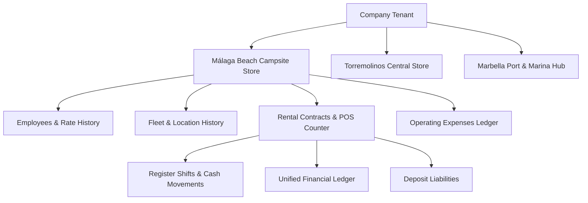

<div align="center">

# 🚲 QQBikes Rental & Store Management System

### Enterprise Multi-Store Platform, POS Counter Engine, Attendance, Payroll & PWA/TWA Mobile System

[🌐 English Version](README.md) | [🇸🇦 النسخة العربية](README_AR.md) | [🚀 Orivex Technology](https://orivex.eu)

[](https://github.com/Eng-Ahmet/QQBikes/actions)
[](https://github.com/Eng-Ahmet/QQBikes/tree/main/backend/src/tests)
[](https://github.com/Eng-Ahmet/QQBikes/blob/main/.github/dependabot.yml)
[](https://orivex.eu)
[](https://nodejs.org)
[](https://angular.dev)
[](https://www.typescriptlang.org)
[](https://www.mysql.com)
[](https://www.docker.com)
[](https://github.com/Eng-Ahmet/QQBikes/blob/main/frontend/public/manifest.json)
[](https://opensource.org/licenses/ISC)

---

</div>

## 🌐 Live Demo & Official Website Links

- **🖥️ Local Live System Interface**: [http://localhost:5000](http://localhost:5000)
- **🚀 Official Engineering Team Site**: [https://orivex.eu](https://orivex.eu)
- **📊 Branch P&L Performance API**: [http://localhost:5000/api/v1/stores/pnl](http://localhost:5000/api/v1/stores/pnl)
- **⚙️ Auth Verification Endpoint**: [http://localhost:5000/api/v1/auth/me](http://localhost:5000/api/v1/auth/me)
- **📱 Android Digital Asset Links**: [http://localhost:5000/.well-known/assetlinks.json](http://localhost:5000/.well-known/assetlinks.json)

---

## 📖 Overview

**QQBikes Rental & Store Management System** is a small multi-store business management platform built for coastal rental facilities. It replaces paper and Excel-based tracking with a real-time, audit-backed POS counter engine, employee attendance system, overtime approvals, audited payroll generation, fleet transfers, workshop repair orders, and multi-branch P&L reporting.

---

## ✨ Core Features & Architectural Principles

### 🏢 Multi-Store & Branch Scoping (`Málaga`, `Torremolinos`, `Marbella`)
- Isolation via `company_id` and request-scoped `X-Store-Context: <id>` middleware.
- Dynamic global store selector with **🌐 All Stores Context** for company administrators.
- Write operations without store context header are rejected with **HTTP 403 Forbidden** (Invariant 13).

### ⏱️ Counter Shift & Cash Register Invariants
- **Single Open Shift Constraint**: MySQL enforces at most one `OPEN` shift per store via a stored generated column (`uq_one_open_shift`).
- Cash register reconciliation tracks physical cash vs card sales separately (`CARD` payments never touch `cash_movements`).

### 👥 Employee Management, Overtime & Payroll Engine
- Configurable historical hourly rates per employee profile.
- Clock-In / Clock-Out attendance tracking and peer shift-swap requests.
- Overtime approval workflow with manager notes.
- Period-based monthly payroll calculator enforcing locked/paid immutability.

### 🚲 Fleet Relocation & Status History
- Full physical inventory tracking across categories (E-Bikes, Scooters, City Bikes, Quad/Buggy).
- Atomic vehicle transfer endpoints with `home_store_id`, `current_store_id`, and `FleetLocationHistory`.

### 💰 Operating Expenses & Audit Reversals
- Log expenses categorized by store.
- Reversal audits (`FinancialAudit`) with mandatory void reasons and request tracking.

### 📱 PWA & Android Trusted Web Activity (TWA)
- Full PWA manifest (`standalone`, `dir: rtl`, `lang: ar`).
- Digital Asset Links (`.well-known/assetlinks.json`) with package ID `com.qqbikes.app.twa`.
- Signed APK build pipeline via `uber-apk-signer` and RSA-2048 keys.

---

## 📐 System Architecture



---

## 🧪 Modular Backend Integration Test Matrix (66/66 Passed)

The repository contains 19 separate, modular test suites covering all backend routes and security invariants:

| Test Module File | Covered Endpoints & Business Invariants | Status |
| :--- | :--- | :---: |
| 📄 [`auth.test.ts`](file:///home/ahmet/Desktop/QQBikes/backend/src/tests/auth.test.ts) | Login, PIN Verification, User Profile (`/auth/*`) | ✅ PASS |
| 📄 [`stores.test.ts`](file:///home/ahmet/Desktop/QQBikes/backend/src/tests/stores.test.ts) | Store Profiles, Status Activation, Branch P&L Metrics (`/stores/*`) | ✅ PASS |
| 📄 [`expenses.test.ts`](file:///home/ahmet/Desktop/QQBikes/backend/src/tests/expenses.test.ts) | Expenses Logging, All-Stores Write HTTP 403 Rejection, Void Audits (`/expenses/*`) | ✅ PASS |
| 📄 [`vehicles.test.ts`](file:///home/ahmet/Desktop/QQBikes/backend/src/tests/vehicles.test.ts) | Fleet Inventory, Status Updates, Atomic Branch Transfers (`/vehicles/*`) | ✅ PASS |
| 📄 [`employees.test.ts`](file:///home/ahmet/Desktop/QQBikes/backend/src/tests/employees.test.ts) | Employee Profiles, Rate Plans, Store Relocation History (`/employees/*`) | ✅ PASS |
| 📄 [`rentals.test.ts`](file:///home/ahmet/Desktop/QQBikes/backend/src/tests/rentals.test.ts) | Contract Creation, Hourly/Daily Extensions, Deposit Refunds (`/rentals/*`) | ✅ PASS |
| 📄 [`shifts.test.ts`](file:///home/ahmet/Desktop/QQBikes/backend/src/tests/shifts.test.ts) | Single Open Shift Enforcement, Opening/Closing Cash Reconciliation (`/shifts/*`) | ✅ PASS |
| 📄 [`shiftDefinitions.test.ts`](file:///home/ahmet/Desktop/QQBikes/backend/src/tests/shiftDefinitions.test.ts) | Shift Templates & Employee Roster Assignments (`/shift-definitions/*`) | ✅ PASS |
| 📄 [`attendance.test.ts`](file:///home/ahmet/Desktop/QQBikes/backend/src/tests/attendance.test.ts) | Clock-In / Clock-Out Attendance Records (`/attendance/*`) | ✅ PASS |
| 📄 [`overtime.test.ts`](file:///home/ahmet/Desktop/QQBikes/backend/src/tests/overtime.test.ts) | Employee Overtime Requests & Manager Approval Engine (`/overtime/*`) | ✅ PASS |
| 📄 [`leaveRequests.test.ts`](file:///home/ahmet/Desktop/QQBikes/backend/src/tests/leaveRequests.test.ts) | Employee Leave & Vacation Approvals (`/leave-requests/*`) | ✅ PASS |
| 📄 [`shiftSwaps.test.ts`](file:///home/ahmet/Desktop/QQBikes/backend/src/tests/shiftSwaps.test.ts) | Peer-to-Peer Shift Exchange Requests (`/shift-swaps/*`) | ✅ PASS |
| 📄 [`payroll.test.ts`](file:///home/ahmet/Desktop/QQBikes/backend/src/tests/payroll.test.ts) | Monthly Payroll Calculator & Period Locking Invariant (`/payroll/*`) | ✅ PASS |
| 📄 [`reports.test.ts`](file:///home/ahmet/Desktop/QQBikes/backend/src/tests/reports.test.ts) | Daily, Monthly, and Dashboard Financial Projections (`/reports/*`) | ✅ PASS |
| 📄 [`repairs.test.ts`](file:///home/ahmet/Desktop/QQBikes/backend/src/tests/repairs.test.ts) | Repair Parts, Labor Rates, Work Order Tickets (`/repairs/*`) | ✅ PASS |
| 📄 [`settlements.test.ts`](file:///home/ahmet/Desktop/QQBikes/backend/src/tests/settlements.test.ts) | Partner Equipment Revenue Settlements (`/settlements/*`) | ✅ PASS |
| 📄 [`settings.test.ts`](file:///home/ahmet/Desktop/QQBikes/backend/src/tests/settings.test.ts) | Dynamic Store Settings Configuration (`/settings/*`) | ✅ PASS |
| 📄 [`tariffs.test.ts`](file:///home/ahmet/Desktop/QQBikes/backend/src/tests/tariffs.test.ts) | Rental Tariff Rules (`/tariffs/*`) | ✅ PASS |
| 📄 [`public.test.ts`](file:///home/ahmet/Desktop/QQBikes/backend/src/tests/public.test.ts) | Public Guided Tour Bookings & Web API (`/public/*`) | ✅ PASS |

---

## 🚀 Quick Start Guide

### Prerequisites
- Node.js `20.x` or `22.x LTS`
- npm `10.x`
- Docker & Docker Compose (Optional)

### 1. Installation & Environment Setup
```bash
git clone https://github.com/Eng-Ahmet/QQBikes.git
cd QQBikes
npm install
```

### 2. Run Application Locally
```bash
# Start backend Express server & watch Angular frontend
npm run dev
```
Open your browser at `http://localhost:5000`.

### 3. Run Automated Integration Test Suite
```bash
npm test
```

### 4. Build Production Bundle
```bash
npm run build
```

### 5. Run via Docker Containers
```bash
docker compose up --build
```

---

## 📄 Documentation References

- **Master Architectural Spec & Deployment Guide**: [`QQBikes_Master_Specification_and_Deployment_Guide.md`](file:///home/ahmet/Desktop/QQBikes/QQBikes_Master_Specification_and_Deployment_Guide.md)
- **Implementation Walkthrough**: [`walkthrough.md`](file:///home/ahmet/Desktop/QQBikes/walkthrough.md)
- **GitHub Action CI Pipeline**: [`.github/workflows/ci.yml`](file:///home/ahmet/Desktop/QQBikes/.github/workflows/ci.yml)

---

<div align="center">

Designed & Built with ❤️ by [**Orivex Technology**](https://orivex.eu) for **QQBikes Management & Rental Facilities**

</div>
