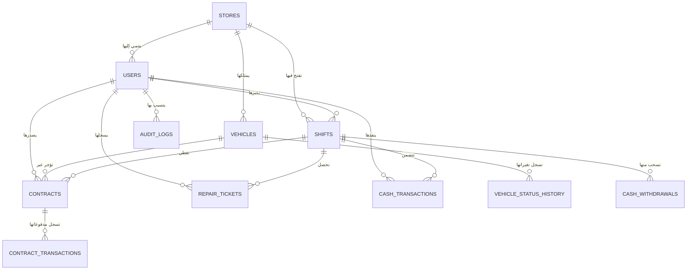

# 📘 وثيقة المواصفات الفنية والهندسية النهائية لنظام QQBikes (Master Technical Specification & Single Source of Truth)

مرحباً بك في **وثيقة المواصفات الهندسية النهائية والحقيقية لنظام QQBikes**. تُعتبر هذه الوثيقة **مصدر الحقيقة الوحيد (Single Source of Truth - SSOT)** لمهندسي وتطوير الباك إند (Backend)، والفرونت إند (Frontend)، وقواعد البيانات (Database Architect).

---

## 🏛️ 1. المبدأ الأساسي ومصدر الحقيقة (Single Source of Truth & Architecture)

### 📌 المبدأ التشغيلي:
1. **قاعدة البيانات (MySQL)** هي **مصدر الحقيقة المباشر والحصري (Single Source of Truth)**.
2. **الذاكرة المؤقتة (Memory State)** تُستخدم كـ Cache فقط لزيادة السرعة، ويُمنع منعاً باتاً اعتماد الذاكرة كمصدر رئيسي للبيانات المالية أو العقود.
3. **منع الحذف النهائي (No Hard Delete Policy)**: يُمنع حذف أي سجل مالي، عقد، تذكرة صيانة، أو حركة صندوق بعد إنشائها. جميع العمليات تعتمد الحذف المنطقي (`status = 'CANCELLED' / 'DELETED'`) مع تسجيل السبب والمسؤول والوقت.

---

## 🗺️ 2. مخطط العلاقات بين الجداول (Entity Relationship Diagram - ERD)

---

## 🗄️ 3. قواعد البيانات الكاملة (Complete Database Schemas & Data Dictionary)

---

### 1️⃣ جدول الفروع (`stores`)
| اسم الحقل | نوع البيانات | الوصف | القيود والافتراضات |
| :--- | :--- | :--- | :--- |
| `id` | BigInt Auto | المعرف الفريد للفرع | Primary Key |
| `name` | Varchar(100) | اسم الفرع | `QQBikes Central Station` |
| `address` | Varchar(255) | عنوان الفرع الجغرافي | `Calle Marina 12, Málaga` |
| `phone` | Varchar(50) | هاتف التواصل للفرع | `+34 952 112 233` |
| `timezone` | Varchar(50) | المنطقة الزمنية | `Europe/Madrid` |
| `currency` | Varchar(10) | العملة المعتمدة | `EUR (€)` |
| `initial_cash_float` | Decimal(10,2) | رصيد الصندوق المبدئي الافتراضي | `150.00` |
| `active` | Boolean | حالة الفرع التشغيلية | `true` |

---

### 2️⃣ جدول المستخدمين والموظفين والصلاحيات (`users`)
| اسم الحقل | نوع البيانات | الوصف | القيود والافتراضات |
| :--- | :--- | :--- | :--- |
| `id` | BigInt Auto | المعرف الفريد للمستخدم | Primary Key |
| `store_id` | BigInt | رقم الفرع التابع له | Foreign Key -> `stores.id` |
| `username` | Varchar(50) | اسم المستخدم | فريد (مثال: `Fran`, `Miguel`) |
| `password_hash` | Varchar(255) | تجزئة كلمة المرور المشفرة | Bcrypt / Arg2 |
| `pin_code` | Varchar(10) | رمز الـ PIN السريع للتبديل | `1234` للأدمن |
| `role` | Enum | الصلاحيات والمنصب | `'ADMIN'`, `'MANAGER'`, `'EMPLOYEE'` |
| `status` | Enum | حالة الحساب | `'ACTIVE'`, `'SUSPENDED'` |
| `created_at` | Datetime | تاريخ إنشاء الحساب | ISO Datetime |

#### 🔑 جدول الصلاحيات الأدوار (Role Permissions Matrix):
- **`EMPLOYEE` (موظف الكاونتر)**: إصدار العقود، استلام المركبة، تسجيل تذاكر الورشة، وإغلاق الشفت اليومي.
- **`MANAGER` (مدير المحل)**: جميع صلاحيات الموظف + تعديل التعرفات، إلغاء العقود، وتعديل حالة الصيانة.
- **`ADMIN` (المالك - Miguel & Quique)**: الوصول الشامل للتحليلات المالية، تعديل الفروع، ومراجعة سجلات الـ Audit Logs.

---

### 3️⃣ جدول أسطول المركبات (`vehicles`)
| اسم الحقل | نوع البيانات | الوصف | القيود والافتراضات |
| :--- | :--- | :--- | :--- |
| `id` | BigInt Auto | المعرف الفريد للمركبة | Primary Key |
| `store_id` | BigInt | رقم الفرع | Foreign Key -> `stores.id` |
| `qr_code` | Varchar(50) | رمز الـ QR والتسلسلي | فريد (مثال: `BK-101`) |
| `frame_number` | Varchar(100) | رقم الهيكل المعدني | فريد |
| `name` | Varchar(100) | اسم المركبة التظاهري | `Quert Mountain Bike` |
| `category` | Enum | فئة المركبة التشغيلية | `'BIKE'`, `'EBIKE'`, `'SCOOTER'`, `'CAR_XL'`, `'QUAD'`, `'BUGGY'` |
| `status` | Enum | حالة المركبة الحالية | `'AVAILABLE'`, `'RENTED'`, `'MAINTENANCE'`, `'RESERVED'`, `'DAMAGED'`, `'INACTIVE'`, `'LOST'` |
| `deposit_amount` | Decimal(10,2) | مبلغ التأمين النقدي المطلوبة (€) | `30.00` إلى `100.00` |
| `item_owner` | Enum | ملكية المركبة | `'STORE'` (المحل), `'NEIGHBOR'` (الجار) |
| `neighbor_name` | Varchar(100) | اسم الجار والشريك | مطلوب إذا كان `item_owner = 'NEIGHBOR'` |

---

### 4️⃣ جدول عقود التأجير (`contracts`)
| اسم الحقل | نوع البيانات | الوصف | القيود والافتراضات |
| :--- | :--- | :--- | :--- |
| `id` | BigInt Auto | المعرف الفريد للعقد | Primary Key |
| `contract_number` | Varchar(50) | رقم العقد الرسمي المولد | صيغة: `CT-{YEAR}-{SEQUENTIAL}` (مثال: `CT-2026-000001`) |
| `store_id` | BigInt | رقم الفرع | Foreign Key -> `stores.id` |
| `vehicle_id` | BigInt | رقم المركبة المؤجرة | Foreign Key -> `vehicles.id` |
| `customer_name` | Varchar(100) | اسم الزبون | **رموز لاتينية فقط** (`isLatinOnly`) |
| `customer_passport` | Varchar(50) | رقم جواز السفر أو DNI | **أحرف وأرقام لاتينية** ($\ge 5$ خانات) |
| `customer_phone` | Varchar(50) | رقم هاتف التواصل | **إجباري للدراجات والسكوترات** |
| `start_time` | Datetime | وقت مغادرة وتسليم المركبة | Datetime |
| `expected_end_time` | Datetime | وقت الإرجاع المتوقع | Datetime |
| `actual_end_time` | Datetime | وقت الإرجاع الفعلي | Datetime |
| `rental_fee` | Decimal(10,2) | رسوم التأجير المحسوبة (€) | عبر محرك Tier Engine |
| `deposit_collected` | Decimal(10,2) | مبلغ التأمين النقدي المقبوض | كاش |
| `deposit_refunded` | Decimal(10,2) | مبلغ التأمين الصافي المرتجع | `collected - extra_charges` |
| `extra_charges` | Decimal(10,2) | رسوم التأخير أو الأضرار (€) | تضاف عند الإرجاع |
| `payment_method` | Enum | طريقة الدفع | `'CASH'`, `'CARD'` |
| `card_last4` | Varchar(4) | آخر 4 أرقام من البطاقة الضامنة | **متوافق مع PCI DSS (يمنع تخزين 16 رقم)** |
| `card_expiry` | Varchar(7) | تاريخ انتهاء البطاقة الضامنة | `MM/YY` |
| `status` | Enum | حالة العقد | `'ACTIVE'`, `'COMPLETED'`, `'CANCELLED'` |

---

### 5️⃣ جدول دفتر الأستاذ للحركات النقدية الحقيقية (`cash_transactions`)
> 💡 **هذا الجدول هو دفتر الأستاذ الحقيقي (True Cash Ledger) الذي يمنع أي عجز أو تلاعب.**

| اسم الحقل | نوع البيانات | الوصف | القيود والافتراضات |
| :--- | :--- | :--- | :--- |
| `id` | BigInt Auto | المعرف الفريد للحركة النقدية | Primary Key |
| `shift_id` | BigInt | رقم الشفت التابعة له الحركة | Foreign Key -> `shifts.id` |
| `type` | Enum | نوع الحركة النقدية | `'OPENING_FLOAT'`, `'RENTAL_PAYMENT'`, `'DEPOSIT_COLLECTED'`, `'DEPOSIT_REFUNDED'`, `'WORKSHOP_PAYMENT'`, `'WITHDRAWAL'`, `'NEIGHBOR_PAYOUT'`, `'OTHER_IN'`, `'OTHER_OUT'` |
| `amount` | Decimal(10,2) | قيمة المبلغ (€) | رقم موجب دائم |
| `direction` | Enum | اتجاه الحركة بالنسبة للدرج | `'IN'` (داخل الدرج), `'OUT'` (خارج من الدرج) |
| `reference_type` | Enum | مصدر الحركة المرجعي | `'CONTRACT'`, `'REPAIR_TICKET'`, `'WITHDRAWAL'`, `'SHIFT'` |
| `reference_id` | BigInt | رقم السجل المرتبط بالحركة | ID |
| `description` | Text | شرح وبيان الحركة النقدية | (مثال: تأمين دراجة مقبوض، شراء قطع غيار) |
| `created_by` | Varchar(50) | اسم المستخدم المنفذ للحركة | `Fran` |
| `created_at` | Datetime | وقت تسجيل الحركة بالضبط | Datetime |

---

### 6️⃣ جدول الشفتات وسجل المطابقة (`shifts`)
| اسم الحقل | نوع البيانات | الوصف | القيود والافتراضات |
| :--- | :--- | :--- | :--- |
| `id` | BigInt Auto | المعرف الفريد للشفت | Primary Key |
| `shift_code` | Varchar(50) | رمز الشفت التلقائي | صيغة: `SFT-{YEAR}-{SEQUENTIAL}` (مثال: `SFT-2026-000001`) |
| `store_id` | BigInt | رقم الفرع | Foreign Key -> `stores.id` |
| `employee_id` | BigInt | رقم الموظف المسؤول | Foreign Key -> `users.id` |
| `opening_cash` | Decimal(10,2) | رصيد الصندوق المبدئي | يتزامن من `stores.initial_cash_float` |
| `closing_cash` | Decimal(10,2) | المبلغ الفعلي المحصى يدوياً | يدخله الموظف عند الإغلاق |
| `expected_cash` | Decimal(10,2) | الرصيد المتوقع الدقيق | **حساب تلقائي من دفتر `cash_transactions`** |
| `discrepancy` | Decimal(10,2) | الفارق أو العجز/الزيادة | `closing_cash - expected_cash` |
| `status` | Enum | حالة الشفت | `'OPEN'`, `'CLOSED'` |
| `notes` | Text | ملاحظات المطابقة الميدانية | شرح العجز إن وجد |

---

### 7️⃣ جدول تذاكر صيانة الورشة (`repair_tickets`)
| اسم الحقل | نوع البيانات | الوصف | القيود والافتراضات |
| :--- | :--- | :--- | :--- |
| `id` | BigInt Auto | المعرف الفريد للتذكرة | Primary Key |
| `ticket_number` | Varchar(50) | رقم التذكرة الرسمي المولد | صيغة: `REP-{YEAR}-{SEQUENTIAL}` (مثال: `REP-2026-000001`) |
| `store_id` | BigInt | رقم الفرع | Foreign Key -> `stores.id` |
| `customer_name` | Varchar(100) | اسم الزبون صاحب السكوتر/الدراجة | لاتيني |
| `customer_phone` | Varchar(50) | هاتف التواصل | صيغة دولية |
| `device_model` | Varchar(100) | موديل جهاز الزبون | `Xiaomi M365 Pro` |
| `issue_description` | Text | العطل المكتوب | `ثقب في الإطار الخلفي` |
| `labor_cost` | Decimal(10,2) | أجور عمل الفني (€) | €15.00 |
| `parts_cost` | Decimal(10,2) | تكلفة قطع الغيار المستخدمة (€) | €20.00 |
| `total_amount` | Decimal(10,2) | المبلغ الإجمالي المستحق (€) | `labor_cost + parts_cost` |
| `payment_method` | Enum | طريقة الدفع | `'CASH'`, `'CARD'` |
| `status` | Enum | حالة الإصلاح | `'PENDING'`, `'IN_PROGRESS'`, `'COMPLETED'`, `'CANCELLED'` |

---

### 8️⃣ جدول مخزون قطع غيار الورشة (`repair_parts`)
| اسم الحقل | نوع البيانات | الوصف | القيود والافتراضات |
| :--- | :--- | :--- | :--- |
| `id` | BigInt Auto | المعرف الفريد للقطعة | Primary Key |
| `sku` | Varchar(50) | رمز القطعة بالمخزن | `PRT-85-TUBE` |
| `name` | Varchar(100) | اسم قطعة الغيار | `إطار داخلي 8.5 بوصة` |
| `quantity_in_stock` | Integer | الكمية المتاحة حالياً | يتناقص تلقائياً عند استخدامها |
| `unit_cost` | Decimal(10,2) | تكلفة الشراء على المحل (€) | €4.00 |
| `selling_price` | Decimal(10,2) | سعر البيع للزبون (€) | €12.00 |

---

### 9️⃣ جدول سحوبات ومصروفات الصندوق (`cash_withdrawals`)
| اسم الحقل | نوع البيانات | الوصف | القيود والافتراضات |
| :--- | :--- | :--- | :--- |
| `id` | BigInt Auto | المعرف الفريد للسحب | Primary Key |
| `withdrawal_code` | Varchar(50) | رمز السحب الرسمي | صيغة: `WTH-{YEAR}-{SEQUENTIAL}` |
| `shift_id` | BigInt | رقم الشفت الساحب | Foreign Key -> `shifts.id` |
| `amount` | Decimal(10,2) | المبلغ المسحوب (€) | موجب |
| `category` | Enum | فئة المصروف | `'PARTS_PURCHASE'`, `'FUEL'`, `'SUPPLIES'`, `'STAFF_POCKET'`, `'OTHER'` |
| `reason` | Text | سبب ووصف السحب الصريح | إجباري |
| `receipt_number` | Varchar(50) | رقم الفاتورة أو وصل الشراء | اختياري |
| `created_by` | Varchar(50) | اسم الموظف الساحب | `Gustavo` |

---

### 🔟 جدول سجل التغييرات والتدقيق الأمنية (`audit_logs`)
| اسم الحقل | نوع البيانات | الوصف | القيود والافتراضات |
| :--- | :--- | :--- | :--- |
| `id` | BigInt Auto | المعرف الفريد لسجل الـ Audit | Primary Key |
| `user_id` | BigInt | رقم المستخدم الذي قام بالحركة | Foreign Key -> `users.id` |
| `action` | Enum | نوع الحركة التغييرية | `'CREATE'`, `'UPDATE'`, `'DELETE'`, `'CANCEL'`, `'LOGIN'`, `'CLOSE_SHIFT'` |
| `entity_type` | Varchar(50) | اسم الجدول/الكيان المعدل | `'CONTRACT'`, `'VEHICLE'`, `'SHIFT'`, `'SETTING'` |
| `entity_id` | BigInt | الرقم التعريفي للكيان المعدل | ID |
| `old_values` | JSON | القيم القديمة قبل التعديل | JSON Object |
| `new_values` | JSON | القيم الجديدة بعد التعديل | JSON Object |
| `ip_address` | Varchar(50) | عنوان الـ IP للجهاز | IP Address |
| `created_at` | Datetime | تاريخ وساعة التعديل | ISO Datetime |

---

### 1️⃣1️⃣ جدول تاريخ تغيرات حالة المركبة (`vehicle_status_history`)
| اسم الحقل | نوع البيانات | الوصف | القيود والافتراضات |
| :--- | :--- | :--- | :--- |
| `id` | BigInt Auto | المعرف الفريد للسجل | Primary Key |
| `vehicle_id` | BigInt | رقم المركبة | Foreign Key -> `vehicles.id` |
| `old_status` | Enum | الحالة السابقة | `'AVAILABLE'` |
| `new_status` | Enum | الحالة الجديدة | `'DAMAGED'` / `'MAINTENANCE'` |
| `reason` | Text | سبب التغيير | (مثال: عودتها بعطل في الفرامل بالعقد CT-2026-000004) |
| `contract_id` | BigInt | رقم العقد المرتبط إن وجد | Foreign Key -> `contracts.id` |
| `changed_by` | Varchar(50) | اسم الموظف | `Fran` |

---

## 🧮 4. المعادلة المالية الرسمية والدقيقة لرصيد الصندوق المتوقع

حساب **الرصيد المتوقع في درج الصندوق (Expected Drawer Cash)** يعتمد كلياً على حركة الأستاذ **`cash_transactions`** الحقيقية كالتالي:

$$\begin{aligned}
\text{Expected Cash} = &\ \text{Opening Cash Float} \\
& + \text{Cash Rental Payments (المقبوضات النقدية للتأجير)} \\
& + \text{Cash Deposits Collected (التأمينات النقدية المقبوضة من الزبائن)} \\
& + \text{Workshop Cash Payments (إيرادات الورشة والصيانة كاش)} \\
& - \text{Cash Deposits Refunded (التأمينات النقدية المرجعة للزبائن عند السلامة)} \\
& - \text{Cash Withdrawals (سحوبات ومصروفات الصندوق)} \\
& - \text{Neighbor Cash Payouts (مستحقات الجار والشريك الصافية المسلمة كاش)}
\end{aligned}$$

---

## ⏳ 5. محرك غرامة التأخير وفترة السماح (Grace Period & Late Return Penalty Rules)

عند إرجاع المركبة في وقت متأخر عن الوقت المحدد في العقد (`expected_end_time`)، يطبق محرك النظام القواعد التالية:

1. **فترة السماح المجانية (Grace Period: 0 إلى 15 دقيقة)**:
   - لا يتم احتساب أي غرامة أو تكلفة إضافية.
2. **التأخير التكتيكي (16 إلى 60 دقيقة تأخير)**:
   - يتم إضافة رسوم **ساعة تأجير إضافية كاملة** تلقائياً حسب فئة المركبة.
3. **التأخير الكلي (أكثر من 60 دقيقة تأخير)**:
   - يتم احتساب رسوم **يوم كامل إضافي** وتضاف إلى حقل `extra_charges` وتخصم من مبلغ التأمين المرتجع للزبون.

---

## 🔒 6. قواعد الأمان وتخزين بطاقات الائتمان (PCI DSS Compliance)

1. **يُمنع منعاً باتاً تخزين رقم بطاقة الائتمان الكامل (16 رقم) أو رمز الـ CVV في قواعد البيانات**.
2. يتم استخراج وتخزين **آخر 4 أرقام فقط (`card_last4`)** وتاريخ الانتهاء (`card_expiry`) لأغراض التثبت والضمانة فقط.

---

🌐 **رابط التشغيل المباشر المعتمد والمطابق للمواصفات**: **`https://qqbikes.orivex.eu/`**
