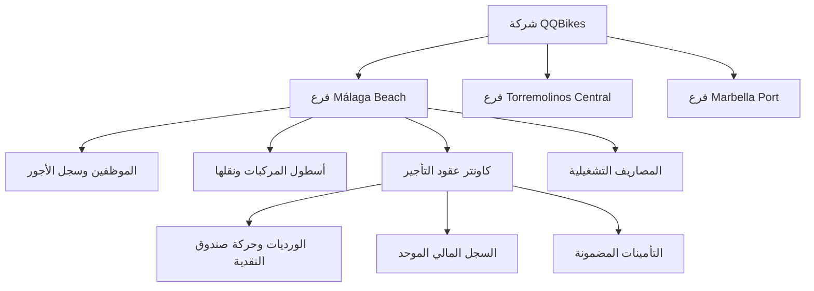

<div align="center">

# 🚲 نظام إدارة التأجير والمتاجر QQBikes

### المنصة المؤسسية لإدارة تأجير الدراجات والمركبات، الورديات، الرواتب والترخيص لـ PWA/TWA

[🌐 English Version](README.md) | [🇸🇦 النسخة العربية](README_AR.md)

[](https://github.com/Eng-Ahmet/QQBikes/actions)
[](https://github.com/Eng-Ahmet/QQBikes/tree/main/backend/src/tests)
[](https://nodejs.org)
[](https://angular.dev)
[](https://www.typescriptlang.org)
[](https://www.mysql.com)
[](https://www.docker.com)
[](https://github.com/Eng-Ahmet/QQBikes/blob/main/frontend/public/manifest.json)
[](https://opensource.org/licenses/ISC)

---

</div>

## 🌐 روابط التجربة المباشرة والنظام (Live Demo & Links)

- **🖥️ واجهة النظام والنقطة المباشرة (Local Live Interface)**: [http://localhost:5000](http://localhost:5000)
- **📊 تقرير الأرباح والخسائر بالفروع (Branch P&L Endpoint)**: `http://localhost:5000/api/v1/stores/pnl`
- **⚙️ فحص صحة الخدمة (Health Check API)**: `http://localhost:5000/api/v1/auth/me`
- **📱 ملف الربط الذكي للأندرويد (Digital Asset Links)**: `http://localhost:5000/.well-known/assetlinks.json`

---

## 📖 نبذة عن النظام

تطبيق **QQBikes Rental & Store Management System** هو نظام مؤسسي لإدارة المتاجر الساحلية المتعددة وتأجير المركبات والدراجات والسكوترات الكهربائية. يحل النظام محل العمليات الورقية وملفات الإكسيل عبر توفير:
- **كاونتر التأجير المباشر (POS Counter Engine)**.
- **إدارة الفروع المتعددة والعزل التجاري (Málaga, Torremolinos, Marbella)**.
- **حساب حضور وانصراف الموظفين والساعات الإضافية وقوالب الورديات**.
- **محرك احتساب الرواتب الشهرية والتدقيق المالي**.
- **إدارة الأسطول ونقل المركبات والموظفين بين الفروع**.
- **سجل المصاريف التشغيلية وعمليات الإلغاء المدققة**.
- **تطبيق PWA وتطبيق أندرويد موقّع عبر Trusted Web Activity (TWA)**.

---

## ✨ المبادئ المعمارية المعتمدة

### 🏢 عزل الفروع والنطاق التجاري
- عزل الشركات عبر `company_id` وتحديد نطاق المتجر هيدر الطلب `X-Store-Context: <id>`.
- يرفض النظام عمليات الكتابة بدون تحديد المتجر بـ **HTTP 403 Forbidden** (القاعدة المعمارية 13).

### ⏱️ قيود صندوق الكاونتر والوردية
- **قيد الوردية المفتوحة الواحدة**: يمنع MySQL فتح أكثر من وردية واحدة لنفس المتجر (`uq_one_open_shift`).
- عزل معاملات الكارت عن حركة النقدية (`cash_movements` مخصصة حصراً للنقدية الفيزيائية `CASH`).

### 👥 إدارة الموظفين والرواتب
- تجميد أسعار العقود والرواتب فور اعتمادها لمنع تعديل البيانات التاريخية.
- احتساب الرواتب الشهرية وتثبيتها بنظام حماية السجلات المفعلة.

---

## 📐 رسم معمارية النظام (Mermaid Flowchart)



---

## 🧪 مصفوفة الاختبارات الـ 19 لنظام الباك اند (66/66 ناجح)

تحتوي بيئة الاختبارات على 19 ملف اختبار موزع يغطي كافة المسارات والقواعد:

| ملف الاختبار | المسارات والقواعد المغطاة | الحالة |
| :--- | :--- | :---: |
| 📄 [`auth.test.ts`](file:///home/ahmet/Desktop/QQBikes/backend/src/tests/auth.test.ts) | الدخول والتسجيل والرمز السري (`/auth/*`) | ✅ ناجح |
| 📄 [`stores.test.ts`](file:///home/ahmet/Desktop/QQBikes/backend/src/tests/stores.test.ts) | إدارة الفروع وأرباح P&L (`/stores/*`) | ✅ ناجح |
| 📄 [`expenses.test.ts`](file:///home/ahmet/Desktop/QQBikes/backend/src/tests/expenses.test.ts) | المصاريف والرفض بـ 403 بدون متجر (`/expenses/*`) | ✅ ناجح |
| 📄 [`vehicles.test.ts`](file:///home/ahmet/Desktop/QQBikes/backend/src/tests/vehicles.test.ts) | الأسطول والنقل الذري بين الفروع (`/vehicles/*`) | ✅ ناجح |
| 📄 [`employees.test.ts`](file:///home/ahmet/Desktop/QQBikes/backend/src/tests/employees.test.ts) | ملفات الموظفين وسجل الأجور بالنقل (`/employees/*`) | ✅ ناجح |
| 📄 [`rentals.test.ts`](file:///home/ahmet/Desktop/QQBikes/backend/src/tests/rentals.test.ts) | العقود والتمديد والتأمينات (`/rentals/*`) | ✅ ناجح |
| 📄 [`shifts.test.ts`](file:///home/ahmet/Desktop/QQBikes/backend/src/tests/shifts.test.ts) | قيد الوردية الواحدة وتسوية الصندوق (`/shifts/*`) | ✅ ناجح |
| 📄 [`shiftDefinitions.test.ts`](file:///home/ahmet/Desktop/QQBikes/backend/src/tests/shiftDefinitions.test.ts) | قوالب وتكاليف الورديات (`/shift-definitions/*`) | ✅ ناجح |
| 📄 [`attendance.test.ts`](file:///home/ahmet/Desktop/QQBikes/backend/src/tests/attendance.test.ts) | بصمة الحضور والانصراف (`/attendance/*`) | ✅ ناجح |
| 📄 [`overtime.test.ts`](file:///home/ahmet/Desktop/QQBikes/backend/src/tests/overtime.test.ts) | الساعات الإضافية وموافقة المدير (`/overtime/*`) | ✅ ناجح |
| 📄 [`leaveRequests.test.ts`](file:///home/ahmet/Desktop/QQBikes/backend/src/tests/leaveRequests.test.ts) | طلبات الإجازات والغياب (`/leave-requests/*`) | ✅ ناجح |
| 📄 [`shiftSwaps.test.ts`](file:///home/ahmet/Desktop/QQBikes/backend/src/tests/shiftSwaps.test.ts) | تبديل الأدوار بين الزملاء (`/shift-swaps/*`) | ✅ ناجح |
| 📄 [`payroll.test.ts`](file:///home/ahmet/Desktop/QQBikes/backend/src/tests/payroll.test.ts) | احتساب الرواتب الشهرية والتدقيق (`/payroll/*`) | ✅ ناجح |
| 📄 [`reports.test.ts`](file:///home/ahmet/Desktop/QQBikes/backend/src/tests/reports.test.ts) | التقارير اليومية والشهرية واللوحة (`/reports/*`) | ✅ ناجح |
| 📄 [`repairs.test.ts`](file:///home/ahmet/Desktop/QQBikes/backend/src/tests/repairs.test.ts) | ورشة الصيانة وقطع الغيار (`/repairs/*`) | ✅ ناجح |
| 📄 [`settlements.test.ts`](file:///home/ahmet/Desktop/QQBikes/backend/src/tests/settlements.test.ts) | تسويات الشركاء والمعدات (`/settlements/*`) | ✅ ناجح |
| 📄 [`settings.test.ts`](file:///home/ahmet/Desktop/QQBikes/backend/src/tests/settings.test.ts) | إعدادات الفروع والتساد (`/settings/*`) | ✅ ناجح |
| 📄 [`tariffs.test.ts`](file:///home/ahmet/Desktop/QQBikes/backend/src/tests/tariffs.test.ts) | تعرفة أسعار التأجير (`/tariffs/*`) | ✅ ناجح |
| 📄 [`public.test.ts`](file:///home/ahmet/Desktop/QQBikes/backend/src/tests/public.test.ts) | الحجوزات العامة للجولات (`/public/*`) | ✅ ناجح |

---

## 🚀 دليل التشغيل والبدء السريع

### 1. تثبيت الاعتمادات
```bash
git clone https://github.com/Eng-Ahmet/QQBikes.git
cd QQBikes
npm install
```

### 2. تشغيل التطبيق في البيئة التطويرية
```bash
npm run dev
```
افتح المتصفح على [http://localhost:5000](http://localhost:5000).

### 3. تشغيل كافة الاختبارات التكاملية
```bash
npm test
```

### 4. بناء ملفات الإنتاج
```bash
npm run build
```

### 5. التشغيل عبر حاويات Docker
```bash
docker compose up --build
```

---

## 📄 المراجع والتوثيق التفصيلي

- **المرجع المعماري الشامل ودليل التثبيت**: [`QQBikes_Master_Specification_and_Deployment_Guide.md`](file:///home/ahmet/Desktop/QQBikes/QQBikes_Master_Specification_and_Deployment_Guide.md)
- **تقرير الإنجاز والخطوات**: [`walkthrough.md`](file:///home/ahmet/Desktop/QQBikes/walkthrough.md)
- **سلسلة البناء الآلي CI/CD**: [`.github/workflows/ci.yml`](file:///home/ahmet/Desktop/QQBikes/.github/workflows/ci.yml)

---

<div align="center">

تم التطوير بحب 🚲 لصالح **منظومة إدارة وتأجير QQBikes**

</div>
